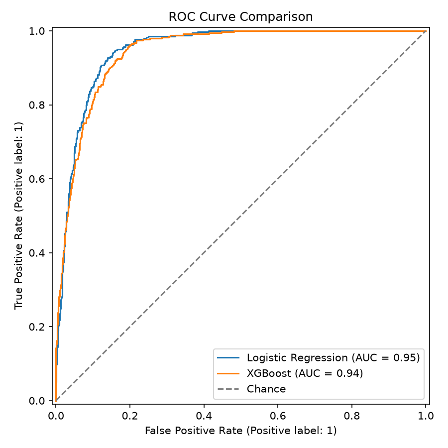

# Loan Processing — AI-Powered Loan Assessment Agent

An end-to-end loan underwriting prototype: it generates a synthetic applicant dataset, trains credit-risk models on it, extracts structured data from uploaded salary slips and bank statements, scores the applicant, and routes every result through a human-in-the-loop (HITL) review dashboard.

> **Note:** this is a demo/portfolio project trained on **synthetic** data. It is not a production credit-decisioning system.

## Highlights

- **Credit-risk model** — Logistic Regression (production) and XGBoost, trained on 10,000 synthetic applicants with 14 features. Logistic Regression AUC **0.949**, XGBoost AUC **0.944** on the held-out test split.
- **Affordability-aware** — the model sees the requested loan's own EMI against income (`Requested_EMI_to_Income_Ratio`), so a large loan over a short tenure is flagged as high risk instead of slipping through.
- **No bureau score** — `CIBIL_Score` is deliberately excluded; the model relies on income, EMI burden, bank balance, and repayment-behaviour signals extracted from documents.
- **Document extraction** — regex parsers for the mock salary slip (PDF) and bank statement (XLSX) first, with a **Gemini multimodal fallback** (Pro → Flash) for documents the regex can't read.
- **HITL review dashboard** — React frontend where every scored applicant lands in *Pending Reviews* for an explicit Approve / Manual Review / Reject decision, logged to Excel.

## Architecture

```
data_generation -> document_simulation -> risk_modeling (label + train) -> extraction -> scoring
                                                                              |
                                              agentic_api (FastAPI)  <-->  frontend (React + Vite)
```

The repo contains four subsystems:

| Subsystem | Location | What it is |
|---|---|---|
| ML pipeline (active) | `src/loan_processing/{data_generation,document_simulation,risk_modeling,extraction}`, `app.py` | Synthetic data → model training → document extraction → CLI risk report |
| `agentic_api` | `src/loan_processing/agentic_api/` | FastAPI service exposing extraction and scoring over HTTP |
| `frontend` | `frontend/` | React + Vite + Zustand dashboard (Upload, Ledger, Insights, Pending Reviews, Decision History) |
| Original rules-based API | `src/loan_processing/{api,ingestion,validation,scoring,decisioning,output}` | Earlier self-contained prototype: regex extraction + DTI-based scoring → Excel report. Not connected to the ML model |

### API endpoints (`agentic_api`)

| Endpoint | Purpose |
|---|---|
| `POST /extraction/preview` | Extract fields from uploaded documents and report which method (regex or Gemini) supplied them. No scoring |
| `POST /scoring/assess` | Extraction + production risk model in one call; returns a Ledger-shaped record |
| `POST /save-applicant` | Append an approve/reject decision to the local Excel log |

`Applicant_ID`, `Applicant_Name`, date of birth, and `Employment_Type` are caller-supplied form fields, not read from the documents.

## Model performance

| Model | Features | Rows | AUC |
|---|---|---|---|
| **Logistic Regression (production)** | 14 | 10,000 | **0.9490** |
| XGBoost | 14 | 10,000 | 0.9435 |



A separate live-scenario benchmark (`risk_modeling/evaluate_live_scenario.py`) re-scores the same held-out set with `Cash_Flow_Trend_Slope` forced missing, to guard against a silent gap between clean-data metrics and real document extraction: recall drops only 0.907 → 0.890.

All figures are on synthetic data with a synthetic default label. A Kaggle real-data benchmark is also included for comparison (see `CLAUDE.md` for the full benchmarking table and caveats).

## Getting started

Requires Python 3.11+ and Node 20.19+ (or 22.12+), as required by the Vite toolchain.

```bash
# Python environment
python -m venv .venv
source .venv/Scripts/activate      # Windows Git Bash; use .venv/bin/activate on macOS/Linux
pip install -e ".[dev]"

# Optional: Gemini fallback for documents regex can't read
cp .env.example .env               # then set GEMINI_API_KEY
```

Regex-readable documents (including this project's own mock ones) work with **no API key at all**; the key is only used when regex extraction fails.

### Run the full app

```bash
# 1. Backend (http://127.0.0.1:8000)
uvicorn loan_processing.agentic_api.main:app --app-dir src --reload

# 2. Frontend (http://localhost:5175) — in a second terminal
cd frontend
npm install
npm run dev
```

Sign in with the placeholder credentials `admin` / `admin@123`, open **New Application**, and upload a salary slip and bank statement from `data/mock_documents/` or `data/demo_documents/`.

> The login is a client-side placeholder that only checks credentials in bundled JS. It is **not** real authentication.

### Score one applicant from the CLI

```bash
python app.py APP01732 1988-04-12
```

Prints a Customer Risk Analysis Report. Sample applicants with mock documents: `APP01732`, `APP04522`, `APP04685`, `APP04743`, `APP06253`.

### Rebuild the ML pipeline from scratch

All steps are seeded and reproducible; the outputs are already committed, so this is optional.

```bash
python -m loan_processing.data_generation.applicant_generator      # data/raw/applicants.csv
python -m loan_processing.document_simulation.generate_mock_documents
python -m loan_processing.risk_modeling.train                      # models/*.pkl, reports/figures/*.png
```

### Run the tests

```bash
pytest
```

## Repository layout

```
app.py                     CLI entry point (scores one applicant)
src/loan_processing/
  data_generation/         synthetic applicant generator
  document_simulation/     mock salary-slip PDFs and bank-statement XLSX files
  risk_modeling/           labeling, EMI helper, training, live-scenario benchmark
  extraction/              regex parsers, Gemini fallback, record builder
  agentic_api/             FastAPI extraction + scoring service
  api/ ingestion/ ...      original rules-based prototype
frontend/                  React + Vite + Zustand dashboard
models/                    trained pipelines (.pkl)
data/                      synthetic data, mock and demo documents
tests/                     unit and integration tests
```

## Known limitations

- Trained on synthetic data; the default label is itself synthetic, so metrics say nothing about real-world lending performance.
- `Is_First_Loan`, requested loan amount/tenure, and bounced-transaction count cannot be read from a salary slip and bank statement alone; where missing, the recommendation is always "Flag for Manual Review".
- The Pipeline page in the dashboard is illustrative and not wired to live data.
- The in-memory review store resets on page refresh (the Excel decision log persists server-side).

See [`CLAUDE.md`](CLAUDE.md) for the detailed design notes, benchmarking history, and known gotchas.
